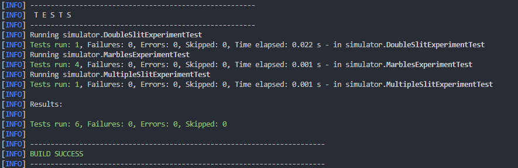

# Simulación de lo clásico a lo cuántico - LAB3 CNYT

- Simulador del experimento de las canicas, con coegficientes booleanos.
- Simulador del experimento de las múltiples rendijas, con más de dos rendijas y asociando siempre 3 blancos a cada una de las rendijas.
- Simulador del experimento de las múltiples rendijas, con más de dos rendijas y asociando cualquier cantidad de blancos a cada uno de las rendijas.

## Para empezar

Estas instrucciones le proporcionarán una copia del proyecto en funcionamiento en su máquina local para fines de desarrollo y pruebas.

### Prerrequisitos

Qué cosas necesitas para instalar el Software:

- Maven
- Java 8+

### Instalando y corriendo

A continuación veras los pasos a seguir para la instalación del software

1. Clona el proyecto en tu maquina.

    ``` console
    git clone https://github.com/SebastianGoenaga/ExperimentSimulator
    ```

2. Entra al directorio recién clonado.

3. Ejecuta los siguientes comandos:
    - Compila nuestro código. De los .java genera los .class.  
    `mvn compile`
    - Compila las pruebas.  
    `mvn test-compile`
    - Ejecuta las pruebas.  
    `mvn test`

### Cómo usar la libreria

1. Copie las siguientes etiquetas en su archivo pom.xml:

    ~~~ xml
    <repositories>
        <repository>
            <id>jitpack.io</id>
            <url>https://jitpack.io</url>
        </repository>
    </repositories>

    <dependencies>
        <dependency>
            <groupId>com.github.SebastianGoenaga</groupId>
            <artifactId>ExperimentSimulator</artifactId>
            <version>afeca25426</version>
        </dependency>
    </dependencies>
    ~~~

2. A continución ya debería ser capaz de usar la librería completa como se muestra en la siguiente imagen de ejemplo. Tiene dos en concreto para utilizar, la de `MarblesExperiment` y `DoubleSlitExperiment`.

    

3. Recuerde acceder a la librería de forma estática.

4. A continuación tiene un ejemplo de `MarblesExperiment`.

~~~ java
    MarblesExperiment marblesExperiment = new MarblesExperiment(6);
    marblesExperiment.setRelation(2, 1);
    marblesExperiment.setRelation(2, 5);
    marblesExperiment.setRelation(3, 3);
    marblesExperiment.setRelation(4, 2);
    marblesExperiment.setRelation(5, 0);
    marblesExperiment.setRelation(5, 4);

    ComplexVector stateVector = new ComplexVector(6);
    stateVector.addToMatrix(0, new Complex(0, 0));
    stateVector.addToMatrix(1, new Complex(0, 0));
    stateVector.addToMatrix(2, new Complex(12, 0));
    stateVector.addToMatrix(3, new Complex(5, 0));
    stateVector.addToMatrix(4, new Complex(1, 0));
    stateVector.addToMatrix(5, new Complex(9, 0));

    marblesExperiment.createStateVector(stateVector);

    ComplexVector answer = marblesExperiment.clickForward(10);

    assertEquals(answerExpected, answer);
~~~

A continuación tiene un ejemplo `DoubleSlitExperiment`.

~~~ java

    // mat1
    Complex c1 = new Complex(0.5, 0);
    Complex c2 = new Complex(0, 0);
    Complex c3 = new Complex(1, 0);
    Complex c4 = new Complex(0.3333333432674408, 0);

    // add

    answerExpected.addToMatrix(0, 0, c2);
    answerExpected.addToMatrix(0, 1, c1);
    answerExpected.addToMatrix(0, 2, c1);
    answerExpected.addToMatrix(0, 3, c2);
    answerExpected.addToMatrix(0, 4, c2);
    answerExpected.addToMatrix(0, 5, c2);
    answerExpected.addToMatrix(0, 6, c2);
    answerExpected.addToMatrix(0, 7, c2);
    answerExpected.addToMatrix(1, 0, c2);
    answerExpected.addToMatrix(1, 1, c2);
    answerExpected.addToMatrix(1, 2, c2);
    answerExpected.addToMatrix(1, 3, c2);
    answerExpected.addToMatrix(1, 4, c2);
    answerExpected.addToMatrix(1, 5, c2);
    answerExpected.addToMatrix(1, 6, c2);
    answerExpected.addToMatrix(1, 7, c2);
    answerExpected.addToMatrix(2, 0, c2);
    answerExpected.addToMatrix(2, 1, c2);
    answerExpected.addToMatrix(2, 2, c2);
    answerExpected.addToMatrix(2, 3, c2);
    answerExpected.addToMatrix(2, 4, c2);
    answerExpected.addToMatrix(2, 5, c2);
    answerExpected.addToMatrix(2, 6, c2);
    answerExpected.addToMatrix(2, 7, c2);
    answerExpected.addToMatrix(3, 0, c2);
    answerExpected.addToMatrix(3, 1, c4);
    answerExpected.addToMatrix(3, 2, c2);
    answerExpected.addToMatrix(3, 3, c3);
    answerExpected.addToMatrix(3, 4, c2);
    answerExpected.addToMatrix(3, 5, c2);
    answerExpected.addToMatrix(3, 6, c2);
    answerExpected.addToMatrix(3, 7, c2);
    answerExpected.addToMatrix(4, 0, c2);
    answerExpected.addToMatrix(4, 1, c4);
    answerExpected.addToMatrix(4, 2, c2);
    answerExpected.addToMatrix(4, 3, c2);
    answerExpected.addToMatrix(4, 4, c3);
    answerExpected.addToMatrix(4, 5, c2);
    answerExpected.addToMatrix(4, 6, c2);
    answerExpected.addToMatrix(4, 7, c2);
    answerExpected.addToMatrix(5, 0, c2);
    answerExpected.addToMatrix(5, 1, c4);
    answerExpected.addToMatrix(5, 2, c4);
    answerExpected.addToMatrix(5, 3, c2);
    answerExpected.addToMatrix(5, 4, c2);
    answerExpected.addToMatrix(5, 5, c3);
    answerExpected.addToMatrix(5, 6, c2);
    answerExpected.addToMatrix(5, 7, c2);
    answerExpected.addToMatrix(6, 0, c2);
    answerExpected.addToMatrix(6, 1, c2);
    answerExpected.addToMatrix(6, 2, c4);
    answerExpected.addToMatrix(6, 3, c2);
    answerExpected.addToMatrix(6, 4, c2);
    answerExpected.addToMatrix(6, 5, c2);
    answerExpected.addToMatrix(6, 6, c3);
    answerExpected.addToMatrix(6, 7, c2);
    answerExpected.addToMatrix(7, 0, c2);
    answerExpected.addToMatrix(7, 1, c2);
    answerExpected.addToMatrix(7, 2, c4);
    answerExpected.addToMatrix(7, 3, c2);
    answerExpected.addToMatrix(7, 4, c2);
    answerExpected.addToMatrix(7, 5, c2);
    answerExpected.addToMatrix(7, 6, c2);
    answerExpected.addToMatrix(7, 7, c3);

    ComplexMatrix answer = DoubleSlitExperiment.likelihood(2);
~~~

### Ingresar casos de prueba

Los siguientes archivos son los que tendrá que modificar si quiere probar otros casos.
`\src\test\java\simulator\DoubleSlitExperimentTest.java`
`\src\test\java\simulator\MarblesExperimentTest.java`
`\src\test\java\simulator\MultipleSlitExperimentTest.java`

Es posible modificar cualquier caso de prueba para corroborar la efectividad del programa.

El resultado al finalizar y ejecutar nuevamente los comandos anteriormente indicados para ejecutar las pruebas, el resultado deberá ser el siguiente:



## Authors

- **Sebastián Goenaga**  -  _Initial work_  -  [ExperimentSimulator](https://github.com/SebastianGoenaga/ExperimentSimulator)

## License

This project is licensed under the MIT License - see the  [LICENSE.md](https://github.com/SebastianGoenaga/ExperimentSimulator/blob/master/LICENSE)  file for details
