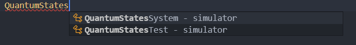
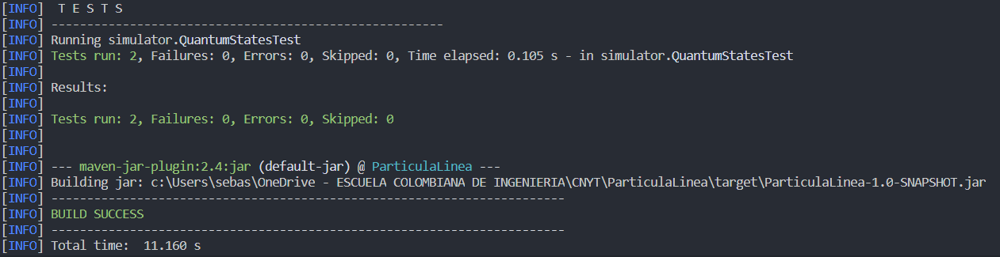

# Sistema cuántico de una partícula en una línea - LAB4 CNYT

1. El sistema debe calcular la probabilidad de encontrarlo en una posición en particular.

2. El sistema si se le da otro vector Ket debe buscar la probabilidad de transitar del primer vector al segundo.

## Para empezar

Estas instrucciones le proporcionarán una copia del proyecto en funcionamiento en su máquina local para fines de desarrollo y pruebas.

### Prerrequisitos

Qué cosas necesitas para instalar el Software:

- Maven
- Java 8+

### Instalando y corriendo

A continuación veras los pasos a seguir para la instalación del software

1. Clona el proyecto en tu maquina.

    ``` console
    git clone https://github.com/SebastianGoenaga/ParticulaLinea
    ```

2. Entra al directorio recién clonado.

3. Ejecuta los siguientes comandos:
    - Compila nuestro código. De los .java genera los .class.  
    `mvn compile`
    - Compila las pruebas.  
    `mvn test-compile`
    - Ejecuta las pruebas.  
    `mvn test`

### Cómo usar la libreria

1. Copie las siguientes etiquetas en su archivo pom.xml:

    ~~~ xml
    <repositories>
        <repository>
            <id>jitpack.io</id>
            <url>https://jitpack.io</url>
        </repository>
    </repositories>

    <dependencies>
        <dependency>
            <groupId>com.github.SebastianGoenaga</groupId>
            <artifactId>ParticulaLinea</artifactId>
            <version>master-SNAPSHOT</version>
        </dependency>
    </dependencies>
    ~~~

2. A continución ya debería ser capaz de usar la librería completa como se muestra en la siguiente imagen de ejemplo.

    

3. Recuerde acceder a la librería de forma estática.

4. A continuación tiene un ejemplo del uso de la librería.

Asociado a `likeliHood`, que es el método encargado de calcular la probabilidad de que una particula esté en una posición determinada (parametro del metodo).

~~~ java
    ComplexVector vector = new ComplexVector(4);

    // mat1
    Complex c1 = new Complex(-3, -1);
    Complex c2 = new Complex(0, -2);
    Complex c3 = new Complex(0, 1);
    Complex c4 = new Complex(2, 0);

    // add

    vector.addToMatrix(0, c1);
    vector.addToMatrix(1, c2);
    vector.addToMatrix(2, c3);
    vector.addToMatrix(3, c4);

    QuantumStatesSystem system = new QuantumStatesSystem(vector);

    double answer = system.likeliHood(2);
~~~

A continuación tiene un ejemplo `transitionAmplitudes`, que calcula la probabilidad de transitar de un vector a otro.

~~~ java

    ComplexVector vector = new ComplexVector(2);
    ComplexVector vector2 = new ComplexVector(2);

    // mat1
    Complex c1 = new Complex(1, 0);
    Complex c2 = new Complex(0, -1);
    Complex c3 = new Complex(0, 1);
    Complex c4 = new Complex(1, 0);

    // add

    vector.addToMatrix(0, c1);
    vector.addToMatrix(1, c2);
    vector2.addToMatrix(0, c3);
    vector2.addToMatrix(1, c4);

    QuantumStatesSystem system = new QuantumStatesSystem(vector);

    Complex answer = system.transitionAmplitudes(vector2);
~~~

### Ingresar casos de prueba

Los siguientes archivos son los que tendrá que modificar si quiere probar otros casos.
`src\test\java\simulator\QuantumStatesTest.java`

Es posible modificar cualquier caso de prueba para corroborar la efectividad del programa.

El resultado al finalizar y ejecutar nuevamente los comandos anteriormente indicados para ejecutar las pruebas, el resultado deberá ser el siguiente:



## Authors

- **Sebastián Goenaga**  -  _Initial work_  -  [ParticulaLinea](https://github.com/SebastianGoenaga/ParticulaLinea)

## License

This project is licensed under the MIT License - see the  [LICENSE.md](https://github.com/SebastianGoenaga/ParticulaLinea/blob/master/LICENSE)  file for details
